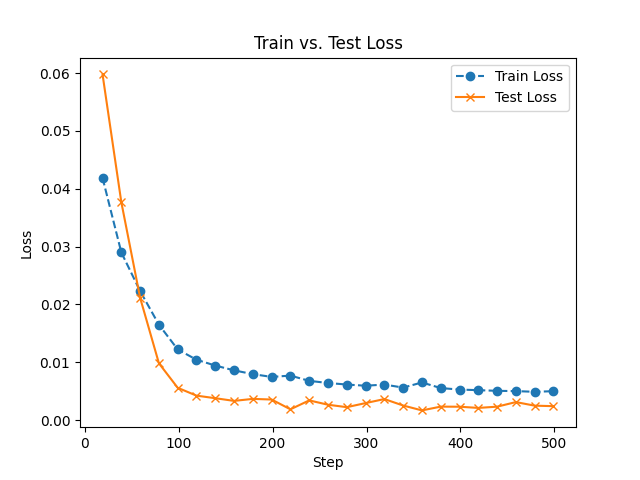
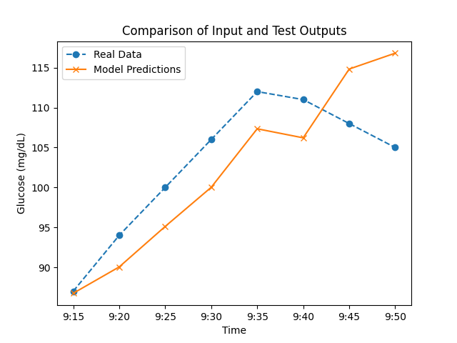
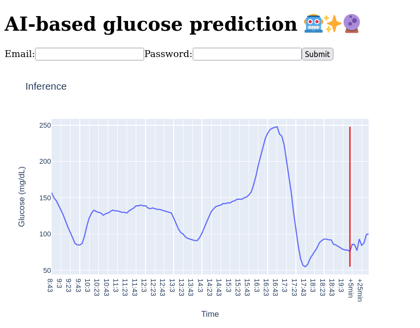

# AI Predicted Glucose Values 🤖✨🔮

This repository contains a machine learning model trained to predict blood sugar levels. Using time series data of glucose values, the model is trained, tested, and can be run in a dash application.

The model can be accessed via the **libreview api_endpoint**.

## Objective
The aim is to predict the next 40 minutes of glucose values based on 640 minutes of historical data. 
This prediction can assist individuals with diabetes in managing their condition more effectively and avoiding potentially dangerous fluctuations in blood sugar levels.

## Model
Currently, the repository offers an LSTM model for glucose forecasting. 
The model is supplemented with historical statistical information in the fully connected layer to enhance prediction accuracy.

## Feature selection
Experiments indicate that the model performs optimally when only glucose data is utilized as input, yielding a Test Loss of 0.0024. 
Although incorporating time data (hour) does not significantly impact results, with the Test Loss remaining at 0.0024, adding information about the day leads to overfitting, resulting in a Test Loss of 0.0034.

### Training the LSTM model

### Testing the LSTM model

### Dash Application
To utilize the dash application, users need their personal libreview login data to connect to the API endpoint.

## Future work
Initial results show promise, suggesting several avenues for future exploration:
- Additional Features: Incorporating additional health data could enhance model predictions. Factors such as heart rate, stress levels, steps taken, and power exertion, which influence blood sugar, will be considered in future experiments.
- Integration with [Large Langue Models](https://arxiv.org/abs/2307.05782): Exploring the potential of Large Language Models for [chatting](https://huggingface.co/docs/transformers/model_doc/tapas) with personal glucose and health data could offer new avenues for analysis and support.
- [RAG](https://arxiv.org/abs/2005.11401) Integration: Integration with Retrieve and Generate (RAG) models could provide insights based on current research and vast document repositories related to diabetes and health, potentially offering personalized assistance with fewer limitations.
- Model Diversification: While the LSTM model serves as an initial attempt, exploring other models for prediction accuracy is essential.
- Responsive Web Application: Developing a responsive web application would extend access to a broader audience, facilitating easier utilization of the predictive capabilities offered by the model.
- Data Privacy: Machine learning models require substantial amounts of data to perform well. Given that health data is highly sensitive and private, it would be beneficial to utilize training techniques such as [federated learning](https://arxiv.org/abs/1602.05629). Federated learning allows models to be trained without centralizing the data, thus preserving privacy.

## Note
I refrain from providing specific data due to data privacy.

